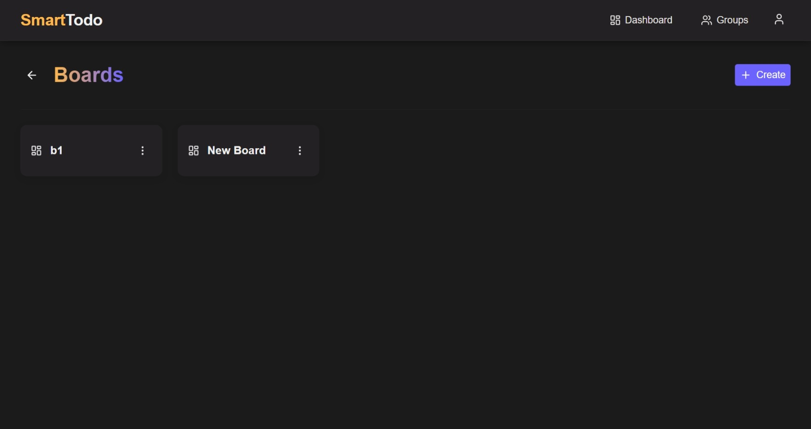
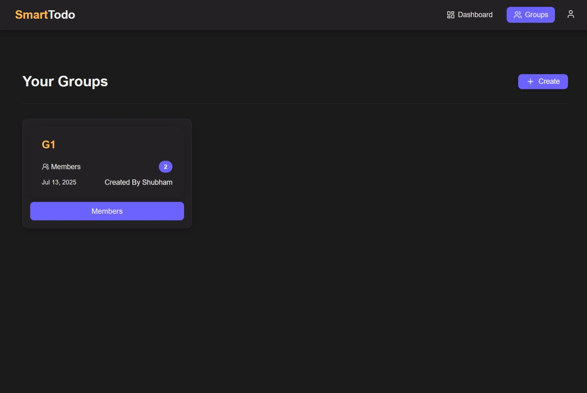
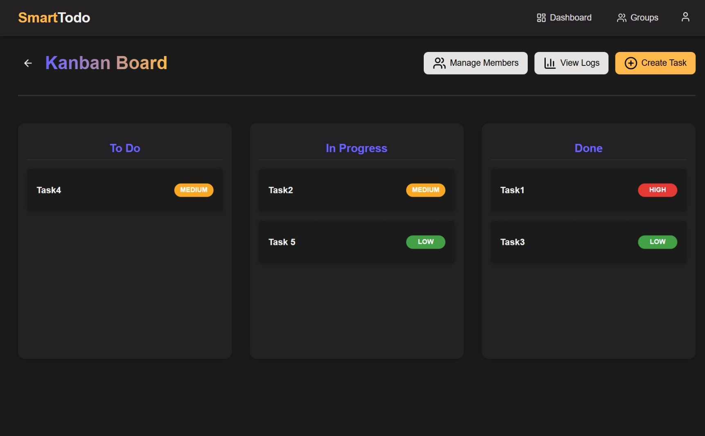

# SmartTodo

SmartTodo is a full-stack task management application inspired by Kanban-style productivity tools. It allows users to manage groups, boards, tasks, and team collaboration in real-time.

## 📸 Screenshots






---

## 🧠 Features

### ✅ Full Stack App with:

- **Frontend:** React + Vite + TypeScript + Zustand + REST API
- **Backend:** Node.js + Express + MongoDB + Mongoose + JWT Authentication
- **Real-time:** Socket.IO for task and board updates
- **Styling:** Plain CSS with CSS variables for theme control

---

# 📦 Frontend – `/client`

## 🛠 Tech Stack

- React + TypeScript
- Vite (for fast development build)
- Zustand (for state management)
- REST API integration (via Axios)
- CSS (with modular architecture)
- Lucide React (for icons)
- Socket.IO (for real-time updates)

## 📁 Folder Structure

```
client/
├── src/
│   ├── api/              # Axios API clients for user, board, group, task, etc.
│   ├── components/       # Reusable UI components
│   ├── pages/            # Page-level views
│   ├── store/            # Zustand store (auth, task)
│   ├── sockets/          # Socket.IO client integration
│   ├── types/            # TypeScript interfaces and types
│   └── main.tsx          # App entry point
```

## 🚀 How to Run

```bash
cd client
pnpm install
pnpm dev
```

## 🧪 Environment

Create a `.env.local` needed in frontend as it communicates with the backend.

```env
VITE_SERVER_API_URL = http://localhost:5173
```

---

# 🔧 Backend – `/server`

## 🛠 Tech Stack

- Node.js
- Express
- MongoDB + Mongoose
- TypeScript
- JWT for auth
- Socket.IO for real-time comms
- Custom error/response handlers

## 📁 Folder Structure

```
server/
├── controllers/    # Route logic (user, task, board, etc.)
├── models/         # Mongoose models (User, Task, Group, etc.)
├── routes/         # Express route definitions
├── db/             # DB connection logic
├── middlewares/    # Auth middleware
├── socket/         # Socket.IO server logic
├── utils/          # Reusable helpers (ApiResponse, ApiError)
├── app.ts          # App config
├── index.ts        # Server entry point
```

## ⚙️ .env Variables

Create a `.env.local` file based on `.env.sample`:

```env
PORT = 8795
MONGODB_URI = URL
CLIENT_URL = http://localhost:5173
DB_NAME = SmartTodo
ACCESS_TOKEN_SECRET = fgj
ACCESS_TOKEN_EXPIRY = "50"
REFRESH_TOKEN_SECRET = shdjjt
REFRESH_TOKEN_EXPIRY = "3048"
```

## 🚀 How to Run

```bash
cd server
pnpm install
pnpm dev
```

---

# 🔗 API Structure

Base URL: `http://localhost:5000/api/v1/`

Example routes:

- `POST /users/signup`
- `POST /users/signin`
- `GET /groups`
- `POST /boards/:groupId`
- `GET /tasks/:boardId`

---

# 🧩 Real-Time Features

- Uses Socket.IO for:
  - Task updates
  - Board membership changes
  - Logs sync between users

---

# 🛡 Authentication

- JWT-based authentication
- Secure routes using middleware
- Auth token stored in local storage

---

# 📌 Todo or Future Enhancements

- Notifications system
- Due date/calendar view
- Enhanced analytics dashboard
- Role-based permissions

---

# 🤝 Contributing

1. Fork the repo
2. Clone it and create a feature branch
3. Commit changes
4. Open a PR

---

# 📃 License

Free To Use

---
